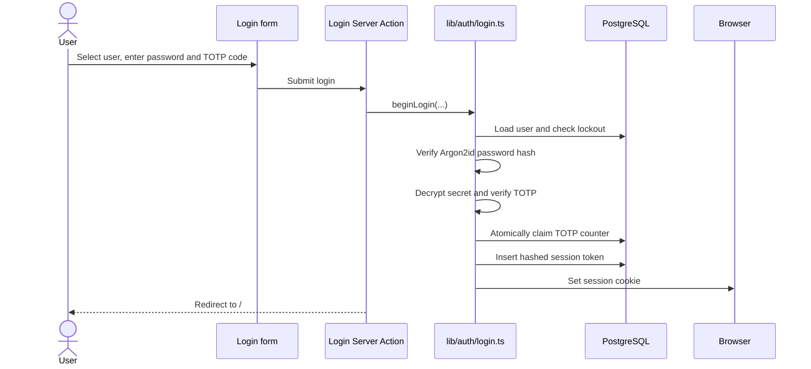
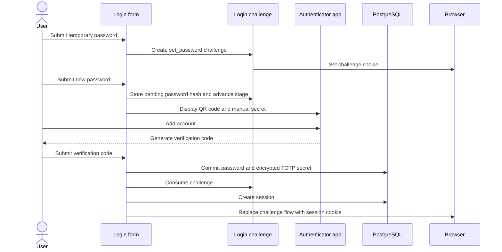

# Authentication

Plan Your Chaos uses administrator-managed, password-plus-TOTP
authentication. Users cannot register, recover an account by email, or reset
their own password or authenticator. An administrator creates the initial
login path and handles later recovery through the `auth:admin` CLI.

This document explains both the login flow and how authentication is enforced
inside the application.

## Architecture overview

Authentication is split across several layers:

| Layer | Responsibility |
| --- | --- |
| `scripts/auth-admin.ts` | Issues temporary passwords, resets TOTP, and cleans up expired authentication records. |
| `app/login` | Renders the login, password setup, and TOTP enrollment forms. |
| `lib/auth/login.ts` | Coordinates password verification, TOTP verification, setup challenges, lockout, and successful login. |
| `lib/auth/challenges.ts` | Manages short-lived password and TOTP setup state. |
| `lib/auth/sessions.ts` | Creates, validates, refreshes, and revokes sessions. |
| `lib/auth/authorization.ts` | Exposes authorization helpers for pages, Server Actions, and API routes. |
| `proxy.ts` | Performs an early cookie-presence check before protected requests reach the application. |
| `app/(authenticated)/layout.tsx` | Performs authoritative session validation for protected pages and provides the authenticated shell. |

The browser receives opaque tokens in HTTP-only cookies. Only SHA-256 hashes
of those tokens are stored in PostgreSQL. Passwords are hashed with Argon2id,
and TOTP secrets are encrypted with AES-256-GCM before being stored.

## Authentication data model

The authentication tables are defined in `db/schema.ts`.

### `users`

Each household member has one user row. Authentication-related columns are:

| Column | Purpose |
| --- | --- |
| `passwordHash` | Argon2id hash of the current password. `null` means no password has been issued. |
| `mustSetPassword` | Requires the user to replace an administrator-issued temporary password. |
| `totpSecretEncrypted` | AES-256-GCM encrypted TOTP secret. |
| `totpEnabledAt` | Indicates that TOTP enrollment was completed. |
| `lastTotpCounter` | Last accepted TOTP time counter, used to reject replayed codes. |
| `failedLoginCount` | Number of consecutive failed login attempts. |
| `lockedUntil` | Prevents login until the lockout expires. |

The seed process creates users and avatars, but it does not assign passwords.
The currently seeded household members are defined in `db/seed.ts`.

### `loginChallenges`

A login challenge carries short-lived state while a user is replacing a
password or enrolling TOTP:

| Column | Purpose |
| --- | --- |
| `tokenHash` | SHA-256 hash of the opaque challenge token held by the browser. |
| `stage` | Either `set_password` or `enroll_totp`. |
| `pendingPasswordHash` | New password hash waiting for TOTP enrollment to finish. |
| `pendingTotpSecretEncrypted` | New encrypted TOTP secret waiting for verification. |
| `expiresAt` | Challenge expiry time. |
| `consumedAt` | Marks the challenge as completed or invalidated. |

Challenges expire after 10 minutes. Creating a challenge invalidates any
other active challenge for the same user. A PostgreSQL advisory transaction
lock serializes challenge creation per user so concurrent login attempts
cannot leave multiple active setup flows.

### `sessions`

A session row contains:

| Column | Purpose |
| --- | --- |
| `tokenHash` | SHA-256 hash of the opaque session token held by the browser. |
| `lastActiveAt` | Last persisted activity time. |
| `idleExpiresAt` | Sliding idle expiry. |
| `absoluteExpiresAt` | Hard maximum session expiry. |
| `revokedAt` | Marks a session as revoked. |
| `revocationReason` | Records why it was revoked. |

## Initial account setup

Seeding the database creates the household members without passwords. An
administrator must issue a temporary password to every user before anyone can
log in.

For local development:

```bash
pnpm auth:admin issue-password --user Tim
```

For a Compose deployment:

```bash
docker compose run --rm migrate \
  pnpm auth:admin issue-password --user Tim
```

The name must exactly match a user in the database. The command:

1. Generates a 32-character base64url temporary password.
2. Hashes it with Argon2id.
3. Stores the hash in `users.passwordHash`.
4. Sets `mustSetPassword` to `true`.
5. Clears failed attempts and any active lockout.
6. Revokes all sessions belonging to the user.
7. Consumes any active login challenges belonging to the user.
8. Prints the temporary password once.

The administrator should share the password through a trusted channel and
destroy their copy after the user receives it.

## Login page

`app/login/page.tsx` first checks whether the browser already has a valid
session. An authenticated visitor is redirected to `/`.

For an unauthenticated visitor, the page loads the household members from the
database and passes them to `LoginForm`. The user selects their identity rather
than entering a username.

`LoginForm` is a Client Component because it uses React's `useActionState` to
move between three form states:

1. `login`
2. `set_password`
3. `enroll_totp`

The forms submit to Server Actions in `app/login/actions.ts`. Those actions
convert form fields into typed inputs and delegate the security-sensitive work
to `lib/auth/login.ts`.

## Standard login flow

The normal login path applies when a user already has a permanent password and
an enrolled authenticator.



`beginLogin` performs these checks:

1. Loads the selected user by numeric ID.
2. Rejects the attempt if the account is currently locked.
3. Clears an expired lockout before continuing.
4. Rejects users without a password hash.
5. Verifies the submitted password against the Argon2id hash.
6. If TOTP is enrolled, decrypts the secret and verifies the submitted code.
7. Rejects a TOTP counter that is not newer than the last accepted counter.
8. Atomically stores the accepted TOTP counter and clears failed-login state.
9. Creates a session and redirects the user into the application.

Failures use the generic message `Invalid credentials.` so the response does
not reveal whether the user, password, TOTP code, or replay check failed.

## First login and forced password replacement

An administrator-issued password always sets `mustSetPassword` to `true`.
After the temporary password is accepted, the application creates a
`set_password` challenge instead of creating a session.

If the account already has TOTP enrolled, the temporary password and current
TOTP code must both be valid before the password setup form is shown.

The replacement password:

- Must contain 12 to 128 characters.
- Must match the confirmation field.
- Must not equal the current temporary password.

Passwords are hashed with Argon2id using the parameters in
`lib/auth/passwords.ts`.

### First login without existing TOTP

New users normally have neither a permanent password nor TOTP. Their complete
setup flow is:



The new password is not immediately written to the user row when TOTP still
needs to be enrolled. Its hash is held in `pendingPasswordHash`. The password,
TOTP secret, and completed setup state are committed together only after the
user proves that their authenticator is working.

This avoids leaving the account partially configured if the browser closes or
the challenge expires during enrollment.

### Password reset with existing TOTP

There is no separate reset-password command. The administrator runs
`issue-password` again:

```bash
pnpm auth:admin issue-password --user Tim
```

All existing sessions are revoked. At the next login, the user submits:

1. The newly issued temporary password.
2. A current code from their existing authenticator.
3. A new permanent password when prompted.

Because TOTP is already enrolled, the application stores the new password,
consumes the challenge, and creates a session without repeating TOTP
enrollment.

## TOTP enrollment

When a user has a valid password but no enrolled TOTP secret, `beginLogin`
creates an `enroll_totp` challenge.

`beginTotpEnrollment` creates a 20-byte TOTP secret and an `otpauth://` URI
with these settings:

| Setting | Value |
| --- | --- |
| Issuer | `Plan Your Chaos` |
| Label | User name |
| Algorithm | SHA-1 |
| Digits | 6 |
| Period | 30 seconds |
| Verification window | One period before or after the current period |

The Server Action converts the URI into a QR code. The form also displays the
base32 secret for manual entry.

Before verification, the secret is encrypted and stored on the login
challenge. Re-rendering the enrollment step reuses that same pending secret
instead of silently generating a different QR code.

When the user submits a valid code:

1. The challenge is atomically claimed and consumed.
2. The encrypted secret is moved to the user row.
3. `totpEnabledAt` is set.
4. The accepted TOTP counter is stored in `lastTotpCounter`.
5. Any pending password hash is promoted to the user row.
6. Failed-login and lockout state is cleared.
7. A session is created.

### TOTP secret encryption

TOTP secrets are encrypted with AES-256-GCM in
`lib/auth/totp-encryption.ts`. Each encrypted value includes:

- A payload version.
- A random 12-byte initialization vector.
- The GCM authentication tag.
- The ciphertext.

`TOTP_ENCRYPTION_KEY` must be exactly 32 bytes encoded as base64:

```bash
openssl rand -base64 32
```

If this key is lost or changed, existing TOTP secrets cannot be decrypted.
Every affected user must have TOTP reset and enroll again.

### TOTP replay protection

A valid TOTP code is not enough by itself. The calculated time counter must be
greater than `users.lastTotpCounter`.

The counter update uses a conditional database update, so concurrent requests
cannot successfully reuse the same code. Only one request can claim a given
counter. A replay is treated as an invalid login attempt.

## Login lockout

Wrong passwords, wrong login-time TOTP codes, and replayed TOTP codes increment
the failed-login counter.

After five consecutive failures:

- `lockedUntil` is set to 15 minutes in the future.
- The stored failed-attempt counter returns to zero.
- Login attempts are rejected with the same generic credentials error.

Once the lockout time has passed, the next login attempt clears the lockout and
starts the failure counter from zero.

A successful TOTP-authenticated login clears the failure state. Completing
TOTP enrollment also clears it. Invalid codes entered while verifying a new
TOTP enrollment return `Invalid verification code.` but do not increment the
normal login lockout counter.

## Setup challenges

The setup flow uses the `plan-your-chaos-login-challenge` cookie. It contains a
random opaque token while PostgreSQL stores only its SHA-256 hash.

Challenge cookies are:

- HTTP-only.
- `SameSite=Lax`.
- Restricted to `/`.
- Marked `Secure` in production.
- Set to expire with the 10-minute database challenge.

The application checks the cookie token, expected stage, expiry, and consumed
state on every setup step. Advancing from password setup to TOTP enrollment
rotates the challenge token and extends the challenge lifetime.

Consuming a challenge clears pending password and TOTP values. Administrative
password or TOTP resets also consume outstanding challenges for the affected
user.

## Session creation and storage

After successful authentication, `createSession`:

1. Generates a random 32-byte opaque token.
2. Stores its SHA-256 hash in the `sessions` table.
3. Sets the idle and absolute expiry times.
4. Places the original token in the `plan-your-chaos-session` cookie.

The session cookie uses the same HTTP-only, `SameSite=Lax`, root-path, and
production-only `Secure` options as the challenge cookie. Its browser expiry is
the absolute session expiry.

If setting the browser cookie fails after the database row was inserted, the
application deletes the orphaned session row before propagating the error.

## Session validation and expiry

`getSession` reads the session cookie and passes it to
`findSessionByToken`. Session validation:

1. Hashes the cookie token.
2. Loads the matching session and user.
3. Rejects revoked sessions.
4. Deletes and rejects sessions that reached either expiry.
5. Extends the idle expiry when enough time has passed since the last
   persisted activity.

Session limits are:

| Limit | Duration |
| --- | --- |
| Idle timeout | 24 hours |
| Absolute lifetime | 7 days |
| Activity write interval | 5 minutes |

The five-minute write interval avoids updating PostgreSQL on every request.
When activity is persisted, the new idle expiry is capped at the absolute
expiry. Activity can therefore keep a session alive for up to seven days, but
never longer.

## Protection inside the application

Authentication is enforced at multiple levels. The early proxy check improves
request handling, while page, Server Action, and API helpers perform
authoritative validation.

### Early request filtering in `proxy.ts`

The proxy allows public paths and requests containing the session cookie.
Public paths include:

- `/`
- `/login`
- Static Next.js files
- Fonts, images, and assets

If a protected page request has no session cookie, the proxy redirects it to
`/login`. If an API request has no session cookie, it returns HTTP `401`.

The proxy checks only whether the cookie exists. It does not query PostgreSQL
or prove that the session is valid. A forged, expired, or revoked cookie can
pass this early check but will fail the later authoritative session lookup.

### Protected pages and the `(authenticated)` route group

Pages under `app/(authenticated)` share
`app/(authenticated)/layout.tsx`. Parentheses make this a Next.js route group,
so the folder name does not appear in URLs:

| File | URL |
| --- | --- |
| `app/(authenticated)/calendar/page.tsx` | `/calendar` |
| `app/(authenticated)/events/page.tsx` | `/events` |
| `app/(authenticated)/user/page.tsx` | `/user` |

The layout calls `requirePageSession`. That helper performs a complete session
lookup and redirects invalid sessions to `/login`.

After validation, the layout passes the authenticated session to
`AuthenticatedShell`, which renders shared UI such as the header, active user,
and footer around the page.

The root `/` page is intentionally public. It calls `getSession` and either
shows a login button or renders the authenticated home dashboard.

### Server Components

Server Components can choose the helper that matches their behavior:

| Helper | Behavior |
| --- | --- |
| `getSession()` | Returns the authenticated session or `null`. Useful for pages that support both public and authenticated views. |
| `requireSession()` | Returns the session or throws `UnauthenticatedError`. |
| `requirePageSession()` | Returns the session or redirects to `/login`. |

### Server Actions

Protected Server Actions call `requireSession()` before performing work that
depends on the current user. For example, event creation uses
`session.user.id` as the event owner instead of trusting a user ID submitted by
the browser.

The authenticated layout protects normal navigation to the page, but the
Server Action must still authorize itself. A client can attempt to invoke an
action directly, so actions must not rely only on the surrounding page layout.

### API routes

Protected API handlers are wrapped with `withApiAuthentication`.

The wrapper:

1. Validates the session from the cookie.
2. Returns HTTP `401` if authentication fails.
3. Allows `GET` and `HEAD` after authentication.
4. Requires a valid same-origin `Origin` header for state-changing methods.
5. Returns HTTP `403` when the origin check fails.
6. Passes the authenticated session into the handler.

API handlers use `session.user.id` for user-owned changes rather than trusting
identity fields in request JSON.

The same-origin check supplements `SameSite=Lax` cookies and protects
state-changing API requests from cross-site submission.

## Logout

`logoutAction` reads the session token and calls `revokeSessionByToken`.
Revocation:

1. Hashes the browser token.
2. Marks the matching session with `revokedAt` and the reason `user_logout`.
3. Expires the session cookie.
4. Redirects the browser to `/login`.

The session row remains available for cleanup and auditing until the cleanup
command deletes it.

## Administrative recovery

Authentication recovery is intentionally administrator-managed.

### Issue or reset a password

There is no separate password reset command. Use `issue-password` for both the
first password and later password resets:

```bash
pnpm auth:admin issue-password --user Tim
```

Production:

```bash
docker compose run --rm migrate \
  pnpm auth:admin issue-password --user Tim
```

This revokes active sessions, invalidates setup challenges, clears lockout
state, and forces the temporary-password flow.

### Reset TOTP

```bash
pnpm auth:admin reset-totp --user Tim
```

Production:

```bash
docker compose run --rm migrate \
  pnpm auth:admin reset-totp --user Tim
```

This removes the enrolled TOTP secret and replay counter, revokes active
sessions, and invalidates setup challenges. It does not change the user's
password. The user logs in with their existing password and then enrolls a new
authenticator.

### Clean up authentication records

```bash
pnpm auth:admin cleanup
```

This permanently deletes:

- Sessions that are expired or revoked.
- Login challenges that are expired or consumed.

## Security properties and boundaries

The implementation provides these protections:

- Passwords are stored only as Argon2id hashes.
- Session and challenge tokens are random, opaque, and hashed in the database.
- Authentication cookies are inaccessible to browser JavaScript.
- TOTP secrets are encrypted at rest with authenticated encryption.
- TOTP counters prevent reuse of accepted codes.
- Login errors avoid revealing which credential failed.
- Repeated failures trigger a timed account lockout.
- Setup challenges are short-lived, single-use, stage-bound, and invalidated
  when a replacement flow begins.
- Password and TOTP reset operations revoke existing sessions.
- Protected APIs authenticate every request and check the origin of unsafe
  methods.
- Protected Server Actions derive identity from the validated session.

The system assumes:

- Administrators can securely run the CLI against the intended database.
- Temporary passwords are shared through a trusted channel.
- `TOTP_ENCRYPTION_KEY` remains secret, available, and unchanged.
- Production traffic is served through HTTPS so `Secure` cookies are usable.
- Every new protected Server Action and API route uses the appropriate
  authorization helper.

## Important source files

| File | Purpose |
| --- | --- |
| `db/schema.ts` | Authentication tables and relationships. |
| `db/seed.ts` | Initial household users. |
| `scripts/auth-admin.ts` | Password issuance, TOTP reset, and cleanup CLI. |
| `app/login/page.tsx` | Loads users and handles already-authenticated visitors. |
| `app/login/LoginForm.tsx` | Client-side state switch between login and setup forms. |
| `app/login/actions.ts` | Server Action entry points for login and logout. |
| `lib/auth/login.ts` | Main login and setup state machine. |
| `lib/auth/passwords.ts` | Argon2id hashing and password validation. |
| `lib/auth/totp.ts` | TOTP creation and code verification. |
| `lib/auth/totp-encryption.ts` | TOTP secret encryption and decryption. |
| `lib/auth/challenges.ts` | Login challenge lifecycle. |
| `lib/auth/sessions.ts` | Session lifecycle. |
| `lib/auth/cookies.ts` | Authentication cookie access and options. |
| `lib/auth/authorization.ts` | Page, Server Action, and API authorization helpers. |
| `lib/auth/constants.ts` | Password, lockout, challenge, session, and TOTP limits. |
| `proxy.ts` | Early session-cookie filtering. |
| `app/(authenticated)/layout.tsx` | Authoritative protection for grouped pages. |

